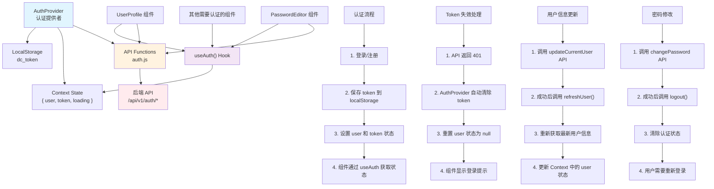

```mermaid
graph TD
    A["AuthProvider<br/>认证提供者"] --> B["LocalStorage<br/>dc_token"]
    A --> C["Context State<br/>{ user, token, loading }"]
    
    D["UserProfile 组件"] --> E["useAuth() Hook"]
    F["PasswordEditor 组件"] --> E
    G["其他需要认证的组件"] --> E
    
    E --> C
    
    H["API Functions<br/>auth.js"] --> I["后端 API<br/>/api/v1/auth/*"]
    
    A --> H
    D --> H
    F --> H
    
    J["认证流程"] --> K["1. 登录/注册"]
    K --> L["2. 保存 token 到 localStorage"]
    L --> M["3. 设置 user 和 token 状态"]
    M --> N["4. 组件通过 useAuth 获取状态"]
    
    O["Token 失效处理"] --> P["1. API 返回 401"]
    P --> Q["2. AuthProvider 自动清除 token"]
    Q --> R["3. 重置 user 状态为 null"]
    R --> S["4. 组件显示登录提示"]
    
    T["用户信息更新"] --> U["1. 调用 updateCurrentUser API"]
    U --> V["2. 成功后调用 refreshUser()"]
    V --> W["3. 重新获取最新用户信息"]
    W --> X["4. 更新 Context 中的 user 状态"]
    
    Y["密码修改"] --> Z["1. 调用 changePassword API"]
    Z --> AA["2. 成功后调用 logout()"]
    AA --> BB["3. 清除认证状态"]
    BB --> CC["4. 用户需要重新登录"]
    
    style A fill:#e1f5fe
    style E fill:#f3e5f5
    style H fill:#fff3e0
    style I fill:#ffebee
```